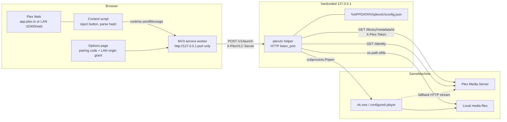
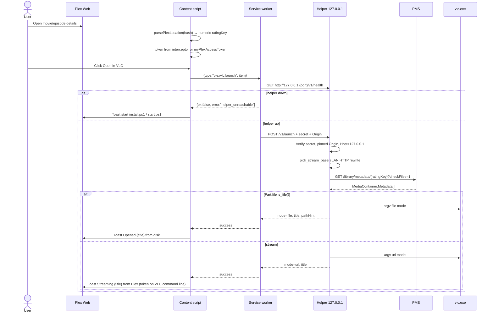
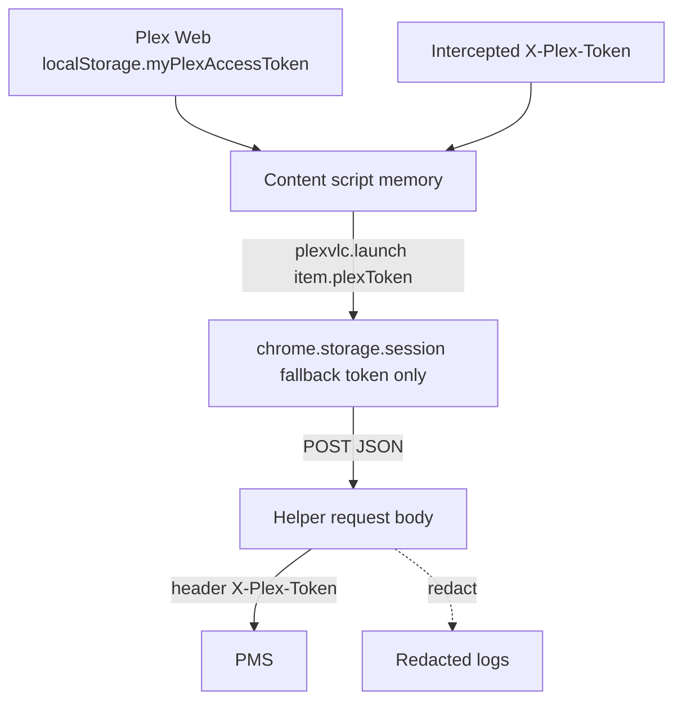

# plexvlc: Open Plex Media in VLC (or any local player)

| Field | Value |
| --- | --- |
| **Title** | plexvlc — Play Plex library items in a local desktop player |
| **Author** | TBD |
| **Date** | 2026-09-08 |
| **Status** | Draft (revised 2026-09-08 after design review) |
| **Workspace** | repository root (greenfield) |
| **Primary OS** | Windows 10/11 |
| **Runtime** | Python 3.11+ stdlib helper + Chrome/Edge Manifest V3 extension |

---

## Overview

Plex Media Server (PMS) on Windows plays video through Plex Web’s HTML5 player. That player transcodes or remuxes many files, has weaker codec/subtitle support than VLC, and cannot open the file sitting on disk. Plex retired the old plugin/channel system; we cannot patch PMS or ship a PMS plugin.

**plexvlc** is a two-process sidecar that sits *next to* Plex, not inside it:

1. A **Chrome/Edge MV3 extension** with a **frozen extension ID** (manifest `key`) injects an “Open in VLC” control into Plex Web (`https://app.plex.tv` and the local PMS web UI). It reads the current item (`ratingKey`) and the user’s existing Plex session token.
2. A **loopback-only Python helper** (always `127.0.0.1`, never a configurable bind host) resolves that item via `GET /library/metadata/{ratingKey}?checkFiles=1`, prefers the local `Part.file` path when the file exists on this machine, otherwise builds an authenticated direct-play URL on a reachable **LAN HTTP** origin when possible, and launches VLC (or a user-configured player).

v1 is an explicit button, a toolbar popup, and a keyboard command. Appearing as a Plex “Play on…” / Cast target is **Appendix A (Phase 2)** — it requires LAN bind, GDM multicast, and a remote-control timeline loop, which conflicts with “never an open relay.”

Auth between extension and helper is a **shared secret bootstrapped by a console-printed one-time pairing code**, not an unauthenticated “give me the secret” GET. The helper is a process launcher: `player.executable` is arbitrary code execution as the helper’s user.

---

## Background & Motivation

### Current state

- User has PMS installed on the same Windows PC they browse Plex Web on (or PMS on a NAS and the files optionally mounted).
- Playback goes through Plex Web (`app.plex.tv/desktop` or `http://127.0.0.1:32400/web`, often also `http://192.168.x.x:32400/web`).
- VLC is already installed and handles the user’s real library (MKV, HEVC, PGS/ASS subs, TrueHD/DTS, stacked multi-part movies) better than the browser.
- There is no supported “Open with…” in Plex Web.

### Why we cannot extend PMS itself

Plex removed the Python plugin/channel framework. There is no supported way to add UI or playback handlers inside PMS. Forking PMS is out of scope.

### Pain points this project removes

| Pain | Result today | plexvlc |
| --- | --- | --- |
| Browser codec limits | Transcode, quality loss, CPU on PMS | Direct file in VLC |
| Sidecar / PGS / ASS subs | Burn-in or missing | VLC autodetect / native tracks; Plex-selected external text subs downloaded to temp |
| Multi-version items | Easy to play the wrong file | Helper uses `Media[0]` (library default). Optional `mediaId` if the extension has it |
| Token wrangling | Users paste `X-Plex-Token` into scripts | Read from the live Plex Web session |
| “Just launch the file” | Manual Explorer hunting | One click from the details page |

### Prior art (researched, not copied)

| Project | Approach | Takeaway for plexvlc |
| --- | --- | --- |
| [iwalton3/plex-mpv-shim](https://github.com/iwalton3/plex-mpv-shim) | Registers as a Plex companion client (GDM + `/player/playback/playMedia` + `/:/timeline`). Cast from any Plex app into mpv. | Best “Play on…” UX, but it is a full remote player: LAN HTTP on port 3000, UDP 32410/32412/32413/32414, timeline thread, play queues, transcode decision API. It streams via PMS (`Part.key`), not the local filesystem. Too large and too open-bind for v1. |
| [Plex Remote Control API](https://github.com/plexinc/plex-media-player/wiki/Remote-control-API) (archived wiki) | `playMedia` takes `key`, `offset`, `machineIdentifier`, `address`, `port`, `protocol`, `token`, `containerKey`. Timeline POST to subscribers. | Phase 2 contract. Do not implement in v1. |
| Greasy Fork “MPV Shim Local Connection” | Userscript injects a fake PMS `/clients` entry so `app.plex.tv` will cast to `127.0.0.1:3000`. | Confirms Plex Web will not discover a loopback-only companion without tricks. |
| Python-PlexAPI `plexapi.media` | Canonical field names: `Part.file`, `Part.key`, `Part.selected`, `Stream.streamType` 1/2/3, `SubtitleStream.key` = `/library/streams/{id}`. | Copy these shapes. |
| [Plexopedia Get Movie](https://www.plexopedia.com/plex-media-server/api/library/movie/) | `GET /library/metadata/{ratingKey}` returns XML `Video` → `Media` → `Part`. JSON equivalent is `MediaContainer.Metadata[]`. | This is the one metadata call v1 needs. **Do not** pass `includeElements=Stream` — official PMS docs say `includeElements` means *only* those child elements are returned, which would omit `Media`/`Part`. |
| Chrome Native Messaging | stdio JSON, host manifest, HKCU registry per browser. | Rejected as the *primary* IPC. Keep as a possible later transport if LNA breaks SW→localhost. |
| Chrome Local Network Access (LNA) | Sites need permission to hit localhost; **extensions with `host_permissions` are currently exempt** (Chromium LNA adoption guide; SW bug 435246545 fixed in M140). | Still declare `http://127.0.0.1/*`. Never `fetch` the helper from the page world. |

---

## Goals & Non-Goals

### Goals (v1)

- From Plex Web (details/preplay/player hash, toolbar popup, context menu, `Alt+Shift+V`), open the current **movie**, **episode**, or **clip** in VLC.
- Default player = VLC; user can set any executable + argument template (`mpv`, MPC-HC, etc.). Setting `player.executable` is arbitrary code execution as the helper user — documented as such.
- Prefer **local filesystem path** when `Part.file` exists and is readable on this PC.
- Fall back to **direct-play stream URL**. Prefer reachable LAN HTTP for that URL (loopback, then dashed-IP LAN, then plex.tv `local && !relay`); HTTPS `*.plex.direct` only if Secure connections = Required. **TLS verification stays on.**
- Honor `mediaId` / `partId` when the extension actually has them; otherwise use library `Media[0]` and all of its `Part`s. v1 does **not** scrape the on-page version dropdown.
- Play multi-part items as a VLC playlist. Resume from metadata `viewOffset` (`--start-time`).
- Auth from the existing Plex Web session. Paste-token is fallback only.
- Helper binds **only** `127.0.0.1` (hardcoded). Pairing uses a one-time code. Never log full tokens.
- Windows-first: `install.ps1` installs a Start Menu + Startup shortcut using `pythonw`; `start.ps1` is a console for debugging.
- Zero runtime third-party Python deps. Tests use `unittest` + stdlib.
- README covering architecture, install, usage.

### Non-goals (v1)

- Forking or patching PMS; PMS plugins/channels.
- A custom Plex desktop client or Electron wrapper.
- Being a Cast/companion target (Appendix A).
- Scrobbling / “Now Playing” / resume-writeback to Plex (Appendix A). v1 *reads* `viewOffset`; it does not write progress back.
- Audio-only, photos, live TV, playlists-as-a-whole, “play this entire show,” Plex Discover / plex.tv metadata items (non-numeric `ratingKey`).
- Transcode-on-PMS playback (`/video/:/transcode/universal/start.m3u8`).
- Publishing to the Chrome Web Store (sideload is the v1 distribution; we still freeze the unpacked ID with a PEM `key`).
- macOS/Linux installers (code should not hard-block them; they are untested).
- Firefox (`moz-extension://` is not allowlisted).
- Replacing Plex Web for browsing.
- Scraping the on-page audio/subtitle/version pickers.

---

## Proposed Design

### High-level architecture



### Sequence: “Open in VLC” from the details page



### Repo layout

```
plexvlcplay\
  README.md
  LICENSE
  .gitignore
  pyproject.toml
  config.example.json
  helper\
    plexvlc\
      __init__.py            # __version__
      __main__.py            # python -m plexvlc / pythonw -m plexvlc
      server.py
      auth.py                # secret, pairing code, origin/host, SSRF, redact
      config.py
      plex.py                # urllib, no redirects, TLS verify, JSON coerce
      resolve.py
      player.py              # template expansion + -- sentinel + Popen
      windows_vlc.py
    scripts\
      start.ps1              # console helper (debug)
      install.ps1            # config, ACL, Start Menu, Startup via pythonw
      uninstall.ps1
  extension\
    manifest.json            # includes "key" (public) for frozen ID
    EXTENSION_ID.txt         # 32-char a-p id derived from that key
    background.js
    content.js
    content.css
    page-hook.js
    options.html
    options.js
    popup.html
    popup.js
    icons\
  tests\
    test_auth.py
    test_resolve.py
    test_player.py
    test_plex.py
    test_windows_vlc.py
    test_server.py
    test_hash.py             # parsePlexLocation fixtures
    fixtures\
      movie_single.json      # include 1/0 booleans AND true/false
      movie_multipart.json
      movie_multiversion.json
      episode.json
      show.json
      photo.json
      streams_external_sub.json
      plex_tv_resources.json # top-level array
      hashes.txt             # documented live hash examples
  shared\
    launch-request.schema.json
    config.schema.json
    messages.md              # extension IPC catalog (this doc is canonical)
```

Python import path: `helper/` is the package root.

```toml
[project]
name = "plexvlc"
version = "0.1.0"
requires-python = ">=3.11"
dependencies = []

[tool.setuptools.packages.find]
where = ["helper"]
```

No Node, no bundler, no Flask. The extension is vanilla JS.

### Process model (helper)

| Entry | Binary | Window | Lifetime |
| --- | --- | --- | --- |
| Debug | `helper\scripts\start.ps1` → `python -m plexvlc` | Console; closing it kills the helper | Foreground |
| Installed | `install.ps1` writes Start Menu + Startup shortcut: `pythonw.exe -m plexvlc` with `PYTHONPATH`/`-m` working from the install location | No console | Until logoff / Exit from tray is **not** required in v1; kill via Task Manager or `uninstall.ps1` |
| Port in use | Bind `127.0.0.1:{listen_port}` raises `OSError` (WSAEADDRINUSE / errno 98) | Print to stderr (console) and append to log: `Port {n} is in use. If plexvlc is already running, use it. Otherwise change listen_port in %APPDATA%\plexvlc\config.json.` Exit code **2**. Do **not** auto-increment (that desyncs the extension). | |
| Single instance | Bind is the lock. Also write `%APPDATA%\plexvlc\helper.pid` with the PID after successful bind; delete on clean exit. | If pid file exists and `os.kill(pid, 0)` succeeds, log “already running pid=N” and exit 2. Stale pid file (process gone) is overwritten. | |
| Bind address | Hardcoded `127.0.0.1`. There is **no** `listen_host` config key. | IPv4 only. Windows `localhost` often resolves to `::1`; the extension and docs always use `http://127.0.0.1`. | |

`helper_misconfigured` is a **process start failure** (unknown `config.version`, missing APPDATA, unreadable config), not an HTTP 500. It never appears as an API error because the server is not listening.

Windows firewall: loopback is not filtered by the standard Windows Defender Firewall profile. No firewall rule is created.

`player.executable` in config is the path that will be `Popen`’d. That is arbitrary code execution for the helper’s user. `install.ps1` ACL’s `%APPDATA%\plexvlc` to the current user only so another Windows user cannot rewrite the executable path.

### How the extension finds the current item

Plex Web is a hash-router SPA. Do **not** depend on obfuscated CSS class names as the primary signal.

v1 is **PMS library items only**. `ratingKey` must be all digits. Plex Discover / `tv.plex.provider.metadata` keys are 24-hex and are out of scope (`unsupported_discover`).

#### Hash fixtures (treat as required test vectors)

These are the shapes implementers must parse. Extra query params (`context=`, `lang=`, …) are ignored.

```
# Hosted details (encoded key)
https://app.plex.tv/desktop/#!/server/{machineId}/details?key=%2Flibrary%2Fmetadata%2F65547

# Hosted details (decoded key + context)
https://app.plex.tv/desktop/#!/server/{machineId}/details?key=/library/metadata/65547&context=source%3Acontent.library~0~2

# Hosted media alias
https://app.plex.tv/desktop/#!/media/{machineId}/details?key=/library/metadata/65547

# Hosted preplay
https://app.plex.tv/desktop/#!/server/{machineId}/preplay?key=%2Flibrary%2Fmetadata%2F65547

# Hosted in-player
https://app.plex.tv/desktop/#!/server/{machineId}/player?key=%2Flibrary%2Fmetadata%2F65547

# Query-style server id (some builds)
https://app.plex.tv/desktop/#!/details?key=%2Flibrary%2Fmetadata%2F65547&server={machineId}

# Local bundled web (loopback, default port)
http://127.0.0.1:32400/web/index.html#!/server/{machineId}/details?key=%2Flibrary%2Fmetadata%2F65547

# Local bundled web (LAN IP — content script only after optional grant)
http://192.168.1.50:32400/web/index.html#!/server/{machineId}/details?key=%2Flibrary%2Fmetadata%2F65547

# OUT OF SCOPE (Discover / plex.tv metadata — 24-hex key)
https://app.plex.tv/desktop/#!/provider/tv.plex.provider.metadata/details?key=/library/metadata/5d776827eb5d26001f1ddab7
```

`tests/test_hash.py` (logic lives in a tiny `extension` mirror or a Python port of `parsePlexLocation` in `tests/hashutil.py` used by unittest; the JS function must match). Duplicate the algorithm in `content.js` comments pointing at the Python tests.

#### `parsePlexLocation(href) -> { ratingKey, machineIdentifier } | { error }`

1. Parse with `new URL(href)`.
2. Take `url.hash`. Strip a leading `#` and an optional leading `!` (`#!/server/...` and `#/server/...` both work).
3. Split on the **first** `?`. Path = before; query = `URLSearchParams(after)`.
4. `key` = query `key`, URL-decoded. If missing → `{ error: "no_key" }` (interceptor may still have an item).
5. If `key` matches `^/library/metadata/([0-9]+)$` → `ratingKey = group 1`.
6. Else if `key` matches `^/library/metadata/([0-9a-f]{20,})$` i → `{ error: "unsupported_discover" }`.
7. Else `{ error: "bad_key" }`.
8. `machineIdentifier`:
   - If path matches `/(?:server|media)/([^/]+)/` → that capture.
   - Else query param `server` if present.
   - Else omit (helper can still work if `pmsBaseUrl` identity matches).
9. Re-run on `hashchange`, `popstate`, and a 500 ms `MutationObserver` on `document.body` (Plex sometimes replaces the hash without firing `hashchange`).

If the key is a show/season, the **helper** rejects after metadata (`unsupported_type`). The button stays visible.

**Conflict rule:** if the hash has a numeric `ratingKey`, it **wins** over the interceptor. The interceptor is only used when the hash has no PMS key (hub hover, some episode rows). This is the main guard against launching the wrong item.

#### Fetch interceptor (secondary)

`page-hook.js` is `"world": "MAIN"`, `"run_at": "document_start"`. It wraps `window.fetch` and `XMLHttpRequest.open/send`.

When a request URL matches `/library/metadata/([0-9]+)` and the path does **not** end with `/children`, `/extras`, `/related`, `/tree`, `/similar`:

```js
window.postMessage({
  source: "plexvlc-page-hook",
  kind: "pms-request",
  ratingKey: "<digits>",
  pmsBaseUrl: new URL(requestUrl).origin,
  plexToken: tokenFromHeaderOrQuery || null,
  href: requestUrl
}, location.origin);
```

It does **not** store state on `window.__plexvlcLastItem` (Plex-page JS could overwrite that).

Isolated-world `content.js`:

```js
window.addEventListener("message", (event) => {
  if (event.source !== window) return;
  if (event.origin !== location.origin) return;
  if (!event.data || event.data.source !== "plexvlc-page-hook") return;
  // copy into content-script memory only
});
```

#### Token capture

Happy path — **no paste**:

| Source | What | How |
| --- | --- | --- |
| Intercepted PMS `X-Plex-Token` (header or query) | Server token (needed for shared servers) | MAIN-world hook, posted to content script |
| `localStorage.myPlexAccessToken` | plex.tv account token | Isolated content script (same origin as Plex Web) |

Do **not** scan localStorage for “20-char” tokens. Classic PMS tokens are ~20 charset-limited; plex.tv JWTs are longer (schema `maxLength: 512`). Use the two sources above. Prefer intercepted server token when present.

Fallback (options page): paste from Plex Web → ⋮ → Get Info → View XML → URL `X-Plex-Token=`. Stored in `chrome.storage.session` only, labeled “fallback token.”

#### UI injection

1. **Details/preplay play row.** Every 1s while `parsePlexLocation` returns a numeric key, find `button`/`a` whose `aria-label` or trimmed text matches `/^play$/i` or `/^watch$/i`. Insert a sibling `<button class="plexvlc-open">Open in VLC</button>` (label uses configured player name from `chrome.storage.local.playerName`, default `"VLC"`).
2. **Toolbar popup:** always available. Asks the active tab’s content script for `plexvlc.detect`. If no content script (LAN origin not granted), the popup shows the grant CTA — it does **not** silently fail. The CTA click runs `permissions.request` in the popup, then `plexvlc.registerLan` to the SW.
3. **Context menu** on Plex URL patterns (static matches + dynamically registered LAN origins).
4. **Keyboard:** `Alt+Shift+V` via `commands`. Background receives `onCommand`, then same path as popup (detect on active tab → launch).

Helper-down toast: `plexvlc helper is not running. Start helper\scripts\start.ps1 or the plexvlc Startup shortcut.`

### Extension IPC catalog (normative)

All `chrome.runtime.sendMessage` / `onMessage` payloads have a `type` string. Unknown types are ignored.

`DetectedItem`:

```json
{
  "ratingKey": "65547",
  "machineIdentifier": "6a646027a56abb6dbdf72484564db8567c737430",
  "pmsBaseUrl": "https://192-168-1-50.abc.plex.direct:32400",
  "plexToken": "<from interceptor or myPlexAccessToken>",
  "titleHint": "Aladdin",
  "mediaId": null,
  "partId": null,
  "offsetMs": null
}
```

v1: `mediaId`, `partId`, `offsetMs` are **omitted or null** unless the interceptor’s metadata JSON (if we ever parse response bodies — **v1 does not parse PMS response bodies**) clearly contains them. Hash has none of these. Helper therefore uses `Media[0]` + all parts + metadata `viewOffset`. PR 7 may start filling these if a cheap, reliable source appears; the helper already accepts them.

| type | From → To | Fields | Notes |
| --- | --- | --- | --- |
| `plexvlc.detect` | popup/background → content | `{}` | Content replies with `plexvlc.detectResult` |
| `plexvlc.detectResult` | content → requester | `{ item: DetectedItem \| null, error?: string }` | `error` in `no_key`, `unsupported_discover`, `bad_key`, `no_token` |
| `plexvlc.launch` | content/popup/background → background | `{ item: DetectedItem }` | Background is the only process that talks to the helper |
| `plexvlc.launchResult` | background → requester | `{ ok, mode?, title?, pathHint?, message, error? }` | `mode` is `file` or `url` |
| `plexvlc.health` | popup/options → background | `{}` | |
| `plexvlc.healthResult` | background → requester | `{ ok, version?, player?, logPath?, listen?, helperPort, error? }` | |
| `plexvlc.pair` | options → background | `{ code: string }` | |
| `plexvlc.pairResult` | background → options | `{ ok, helperPort?, error? }` | On success, background writes `helperSecret` + `helperPort` to `chrome.storage.local` |
| `plexvlc.registerLan` | options/popup → background | `{ origin: string }` | SW **only** `registerContentScripts` / `executeScript`. Must **not** call `permissions.request` (user gesture is already consumed in the popup/options click handler). |

**Helper URL:** always `http://127.0.0.1:${helperPort}` — never `localhost`, never IPv6. `helperPort` from `chrome.storage.local`, default `18765`. Options page can edit it if the user changed `listen_port`.

**Popup detect path:**

The popup is an action click, which is a user gesture. Manifest includes `activeTab` so `Tab.url` is available for the active tab even when that origin is not in `host_permissions`.

1. `chrome.tabs.query({ active: true, currentWindow: true })` — with `activeTab`, `tab.url` is populated.
2. `chrome.tabs.sendMessage(tab.id, { type: "plexvlc.detect" })`
3. If `lastError` (no receiver): show “This tab is not a Plex page, or plexvlc has no permission for this origin.” Button: “Allow this origin”. **The button’s click handler** (still in `popup.js` / `options.js`, still a user gesture) does:
   1. `origin = new URL(tab.url).origin`
   2. `chrome.permissions.request({ origins: [origin + "/*"] })` — **here**, not in the service worker. `runtime.sendMessage` does **not** preserve the user gesture, so a SW `permissions.request` will often fail silently.
   3. On grant, `chrome.runtime.sendMessage({ type: "plexvlc.registerLan", origin })` so the SW can `registerContentScripts` / `executeScript`.
4. Else if `item` is null: show `error` text (Discover, no key, no token).
5. Else show `{titleHint || ratingKey}` and “Open in VLC”. Optionally show `pmsBaseUrl`. After launch, show `mode` from the result (disk vs stream) **before** the user has to look at VLC.

### LAN content-script injection

Static `content_scripts.matches` cover hosted Plex Web, loopback, and `*.plex.direct`. They do **not** cover `http://192.168.x.x:32400/web`. Optional host permissions do **not** inject scripts by themselves.

`chrome.permissions.request({ origins: [origin + "/*"] })` runs in the **popup or options click handler** (user gesture). The service worker must not call it. After the grant succeeds, the popup/options page messages `{ type: "plexvlc.registerLan", origin }` (e.g. `http://192.168.1.50:32400`). The SW then:

```js
await chrome.scripting.registerContentScripts([
  {
    id: "plexvlc-lan-" + origin,
    matches: [origin + "/web/*"],
    js: ["content.js"],
    css: ["content.css"],
    runAt: "document_idle",
    persistAcrossSessions: true
  },
  {
    id: "plexvlc-lan-hook-" + origin,
    matches: [origin + "/web/*"],
    js: ["page-hook.js"],
    runAt: "document_start",
    world: "MAIN",
    persistAcrossSessions: true
  }
]);
```

Then `chrome.scripting.executeScript` once on the current tab so the user does not have to refresh (isolated world `content.js` only; MAIN hook needs a reload — tell the user “reload the Plex tab once” if the hook is missing).

On options page load, re-register for all currently granted origins (idempotent `id`s). Options “Allow this origin” uses the same click-handler `permissions.request` + `plexvlc.registerLan` split.

Popup-only fallback when injection is absent: detect fails with no receiver; user grants origin or uses only tabs that already match static patterns (`app.plex.tv`, loopback `/web/*`, plex.direct).

Static **content script** loopback matches are `http://127.0.0.1/web/*` and `http://localhost/web/*` (port omitted ⇒ `:*`, [Match patterns](https://developer.chrome.com/docs/extensions/develop/concepts/match-patterns)). That covers non-32400 bundled web UIs **without** injecting `page-hook.js` into every loopback HTTP app (dev servers, the helper at `:18765`, etc.). `host_permissions` still use `http://127.0.0.1/*` and `http://localhost/*` so the SW can `fetch` the helper.

Do **not** request `http://*:32400/*`.

### Exact Plex API usage

All helper→PMS and helper→plex.tv calls use:

```
Accept: application/json
X-Plex-Token: <token>
X-Plex-Client-Identifier: <uuid from config>
X-Plex-Product: plexvlc
X-Plex-Version: 0.1.0
X-Plex-Platform: Windows
X-Plex-Device-Name: plexvlc
```

Timeout: 10 s. **Redirects are disabled** (custom `urllib.request.HTTPRedirectHandler.redirect_request` → `None`, or `http.client` with no follow). After DNS resolution, the connected IP must pass the SSRF allowlist before the body is read; if a future implementer re-enables redirects, each hop must be re-validated.

TLS: `ssl.create_default_context()` — **never** disable verification. No `ssl._create_unverified_context`. If plex.direct HTTPS fails cert verify, that candidate is skipped (`plex_tls_failed` only if no other candidate worked).

#### JSON coercion

PMS JSON is sloppy. Parsers **must** use:

```python
def plex_bool(v) -> bool:
    return v in (True, 1, "1", "true", "True")

def plex_int(v):
    if v is None or v == "":
        return None
    return int(v)  # accepts 73681 or "73681"

def plex_str(v) -> str:
    if v is None:
        return ""
    return str(v)
```

XML `claimed="1"` vs JSON `claimed: true` both happen. Fixtures include both 1/0 and true/false.

JSON metadata is `MediaContainer.Metadata[]`, **not** XML `<Video>`. Implementers targeting JSON must not look for a `Video` key.

#### Identity (token optional on LAN)

```
GET {candidate}/identity
```

```json
{
  "MediaContainer": {
    "claimed": true,
    "machineIdentifier": "6a646027a56abb6dbdf72484564db8567c737430",
    "version": "1.41.x.xxxx-xxxxxxxx"
  }
}
```

`claimed` may be `true` or `1`. Compare `machineIdentifier` as a string.

#### Metadata (required)

```
GET {pms}/library/metadata/{ratingKey}?checkFiles=1
```

**Do not** add `includeElements=Stream`. [developer.plex.tv](https://developer.plex.tv/pms/) : `includeElements` means **only** those child elements are included, so `includeElements=Stream` can omit `Media`/`Part` and break resolve. A plain metadata GET already returns `Media` → `Part` → `Stream` (Plexopedia Get Movie; python-plexapi). If a PMS build omits `Stream`, continue without subtitle download (file mode still works; VLC autodetects sidecars). Do not retry with `includeElements`.

`checkFiles=1` populates Part `exists` / `accessible` from the **server’s** point of view. We still call `Path.is_file()` locally.

Real JSON shape (Plexopedia XML converted to the actual JSON envelope). Note mixed bool types in fixtures:

```json
{
  "MediaContainer": {
    "size": 1,
    "librarySectionID": 2,
    "Metadata": [
      {
        "ratingKey": "65547",
        "key": "/library/metadata/65547",
        "type": "movie",
        "title": "Aladdin",
        "year": 1992,
        "duration": 5423794,
        "viewOffset": 120000,
        "Media": [
          {
            "id": 73681,
            "duration": 5423794,
            "videoCodec": "h264",
            "audioCodec": "ac3",
            "container": "mkv",
            "videoResolution": "480",
            "Part": [
              {
                "id": 73812,
                "key": "/library/parts/73812/1450141780/file.mkv",
                "file": "M:\\Media\\Movies\\Aladin (1992)\\Aladin (1992) [480p h.264][AAC AC3].mkv",
                "duration": 5423794,
                "container": "mkv",
                "size": 1639520577,
                "exists": 1,
                "accessible": true,
                "Stream": [
                  { "id": 40197, "streamType": 1, "codec": "h264", "default": 1 },
                  { "id": 40198, "streamType": 2, "codec": "aac", "selected": 1, "languageCode": "eng" },
                  { "id": 40200, "streamType": 3, "codec": "srt", "selected": true, "languageCode": "eng", "key": "/library/streams/40200" }
                ]
              }
            ]
          }
        ]
      }
    ]
  }
}
```

**Stream types** (python-plexapi): `1` video, `2` audio, `3` subtitle, `4` lyrics. External subs have `key` `/library/streams/{id}`. Embedded subs usually have no `key`.

`Media.selected` is a **session** field, not a reliable library-metadata field. v1 **ignores** `Media.selected`.

#### Direct-play URL

VLC will not send `X-Plex-Token` as a header, so the token **must** be a query parameter:

```
{streamBase}{Part.key}?X-Plex-Token={token}
```

Do **not** use `/video/:/transcode/universal/start.m3u8` in v1.

#### plex.tv resources (used for LAN rewrite, not only when `pmsBaseUrl` is missing)

```
GET https://plex.tv/api/v2/resources?includeHttps=1&includeRelay=1
Accept: application/json
X-Plex-Token: {token}
X-Plex-Client-Identifier: {config.client_identifier}
X-Plex-Product: plexvlc
```

**Required:** `X-Plex-Client-Identifier` — without it v2 returns **400**. Response is a **top-level JSON array** of devices, not a `MediaContainer`.

```json
[
  {
    "name": "Living Room NAS",
    "product": "Plex Media Server",
    "clientIdentifier": "6a646027a56abb6dbdf72484564db8567c737430",
    "provides": "server",
    "owned": true,
    "accessToken": "<server-token>",
    "connections": [
      {
        "protocol": "http",
        "address": "192.168.1.50",
        "port": 32400,
        "uri": "http://192.168.1.50:32400",
        "local": true,
        "relay": false,
        "IPv6": false
      },
      {
        "protocol": "https",
        "address": "192.168.1.50",
        "port": 32400,
        "uri": "https://192-168-1-50.<hash>.plex.direct:32400",
        "local": true,
        "relay": false
      },
      {
        "protocol": "https",
        "address": "203.0.113.9",
        "port": 32400,
        "uri": "https://203-0-113-9.<hash>.plex.direct:32400",
        "local": false,
        "relay": false
      }
    ]
  }
]
```

`provides` is a **comma-separated string**. Match `clientIdentifier == machineIdentifier` and `"server" in { t.strip() for t in provides.split(",") }` (strip tokens so `"server, player"` still matches). Use that device’s `accessToken` when calling that PMS if it differs from the web token (shared servers). Prefer `connections[]` with `local && !relay`. Never use `relay: true` in v1.

### Stream-base selection (`pick_stream_base`)

Used whenever we need to talk to PMS (metadata GET and stream URLs). File mode still uses this for metadata.

```
pick_stream_base(machine_id, pms_base_url, token) -> origin string
```

Probe = `GET {origin}/identity` with redirects off, TLS verify on, 2 s timeout. Success if `machineIdentifier` matches (or `machine_id` is missing and identity returns 200).

Order:

1. **Loopback HTTP.** `http://127.0.0.1:32400`. If `pms_base_url` is already loopback with a different port, also try that port. Do **not** probe `http://localhost` (IPv6).
2. **Dashed plex.direct → LAN HTTP.** If `pms_base_url` host matches `^(\d{1,3}(?:-\d{1,3}){3})\.[0-9a-f]+\.plex\.direct$`, un-dash to IPv4 (`192-168-1-50` → `192.168.1.50`). If that IP is RFC1918, probe `http://{ip}:{port}` (port from the URL, default 32400).
3. **plex.tv resources, local HTTP.** `local && !relay && protocol==http` (or `uri` starts with `http://`). Probe each. Use `accessToken` from that device.
4. **resources, local HTTPS.** `local && !relay` HTTPS (Secure connections = Required). TLS verify **on**. plex.direct certs are issued for the dashed name; this often works in Python/`ssl` even when VLC’s TLS stack fails — we still prefer (1)–(3) so VLC gets HTTP.
5. **Original `pmsBaseUrl`** if it passed the SSRF allowlist and identity probe.

If nothing probes: `plex_unreachable`.

VLC stream URLs are built from the **chosen origin**. If the only remaining origin is HTTPS plex.direct, VLC may fail TLS — toast already says we are streaming; error `player_launch_failed` is not used (VLC still started). Document: set Plex **Secure connections = Preferred** so LAN HTTP exists.

### Local vs remote file detection

`resolve_launch(meta, *, stream_base, token, media_id=None, part_id=None, offset_ms=None) -> LaunchPlan`

```
LaunchPlan:
  mode: "file" | "url"
  paths: [str, ...]
  urls: [str, ...]
  title: str
  start_seconds: int
  sub_file: str | None
  media_id: int
  part_ids: [int]
  path_hint: str        # first path or redacted first url (no token) for toasts
```

Per selected parts:

1. If `Part.file` non-empty **and** `Path(file).is_file()` **and** `os.access(file, os.R_OK)` → `mode=file`.
2. Else if `Part.key` and `stream_base` → `mode=url`.
3. Else `no_playable_part`.

If *any* selected part is file-mode and another is not, still launch what we can: all existing files first; if **none** exist, all stream URLs. Do not mix files and URLs in one argv (VLC would open a mix of local and tokenized HTTP). Mixed → file-only if ≥1 file exists, else url-only.

PMS `exists=false` is informational. Docker `/data/movies/...` on Windows → stream.

**Selected version (v1):**

- If request `mediaId` is set: `Media` whose `plex_int(id) == mediaId`, else `not_found`.
- Else **`Media[0]`**. Do not use `Media.selected`. The on-page version dropdown is not scraped.

**Parts:**

- If request `partId` is set: that part only.
- Else **all** `Part` children of the chosen `Media`, API order (stacked CD1/CD2). Do not drop parts because `Part.selected` is false.

**Resume:** `offset_ms` if provided, else `plex_int(Metadata.viewOffset)`. If `0 < offset < 0.9 * duration` → `start_seconds = offset // 1000`, else `0`. Multi-part: `--start-time` applies to the first file only (VLC limitation, documented).

**Episode title:** if `type==episode` and `grandparentTitle` present: `"{grandparentTitle} - s{parentIndex:02d}e{index:02d} - {title}"` (indices coerced; missing index omits the sXXeYY segment).

### VLC discovery on Windows

`windows_vlc.discover_vlc() -> Path | None`. First existing `vlc.exe` wins:

1. `config.player.executable` if absolute and exists.
2. Registry: `HKLM\SOFTWARE\VideoLAN\VLC` `InstallDir`, `HKLM\SOFTWARE\WOW6432Node\VideoLAN\VLC`, `HKLM\SOFTWARE\Microsoft\Windows\CurrentVersion\App Paths\vlc.exe` (default value = full exe), same under `HKCU`.
3. `%ProgramFiles%\VideoLAN\VLC\vlc.exe`, `%ProgramFiles(x86)%\...`, `%LOCALAPPDATA%\Programs\VideoLAN\VLC\vlc.exe`.
4. `shutil.which("vlc")` / `which("vlc.exe")`.

Non-VLC players skip discovery and **require** `player.executable`.

### Player argument templates

```json
"player": {
  "name": "VLC",
  "executable": "",
  "args_file": ["--start-time={start_seconds}", "--sub-file={sub_file}", "{paths}"],
  "args_url": ["--start-time={start_seconds}", "--sub-file={sub_file}", "{urls}"],
  "args_extra": ["--no-video-title-show"]
}
```

`args_extra` is prepended to the chosen template (file or url).

#### Expansion algorithm (`player.expand(template, ctx) -> list[str]`)

`ctx` has `paths: list[str]`, `urls: list[str]`, `title: str`, `start_seconds: int`, `sub_file: str | None`, `sub_url: str | None`.

Reject at config-load if a template contains both `{path}` and `{paths}`, or both `{url}` and `{urls}`.

```
out = []
for arg in template:
    if arg in ("{path}", "{paths}"):
        out.extend(ctx.paths)
        continue
    if arg in ("{url}", "{urls}"):
        out.extend(ctx.urls)
        continue
    if "{sub_file}" in arg and not ctx.sub_file:
        continue          # drop the entire argv element
    if "{sub_url}" in arg and not ctx.sub_url:
        continue
    s = arg
    s = s.replace("{start_seconds}", str(ctx.start_seconds))
    s = s.replace("{title}", sanitize_title(ctx.title))
    s = s.replace("{sub_file}", ctx.sub_file or "")
    s = s.replace("{sub_url}", ctx.sub_url or "")
    s = s.replace("{path}", ctx.paths[0] if ctx.paths else "")
    s = s.replace("{url}", ctx.urls[0] if ctx.urls else "")
    out.append(s)

# Sentinel for VLC and mpv only (name case-insensitive, exact set {vlc, mpv}):
# Insert "--" immediately before the first argv element that is a member of
# ctx.paths or ctx.urls (the positional media). If none, do not insert.
if player_name in {"vlc", "mpv"}:
    media = set(ctx.paths) | set(ctx.urls)
    for i, a in enumerate(out):
        if a in media:
            out.insert(i, "--")
            break

return args_extra + out
```

`sanitize_title`: strip `\x00-\x1f`, strip leading `-` characters, truncate to 200 chars. Prevents `--meta-title=--help` style flags.

#### Worked argv — 2-part local movie, resume 120s, no Plex external sub

Template: `["--start-time={start_seconds}", "--sub-file={sub_file}", "{paths}"]`  
`args_extra`: `["--no-video-title-show"]`

```
vlc.exe --no-video-title-show --start-time=120 -- D:\Media\Movie\CD1.mkv D:\Media\Movie\CD2.mkv
```

`--sub-file={sub_file}` was dropped. `--` stops VLC treating a path that starts with `-` as a flag.

#### Worked argv — stream + downloaded SRT

```
vlc.exe --no-video-title-show --start-time=0 --sub-file=C:\Users\...\AppData\Local\Temp\plexvlc\65547.eng.srt -- http://192.168.1.50:32400/library/parts/73812/1450141780/file.mkv?X-Plex-Token=…
```

MPC-HC example uses `{path}` which expands to **all** parts as separate args (queued). MPC-HC does not get the `--` sentinel.

#### Process creation

```python
flags = 0
if os.name == "nt":
    flags = subprocess.CREATE_NEW_PROCESS_GROUP | subprocess.DETACHED_PROCESS
    # Do NOT set CREATE_NO_WINDOW — that can hide a GUI player when the
    # helper is pythonw. pythonw already has no console.
subprocess.Popen(argv, close_fds=True, creationflags=flags)
```

Never `shell=True`. Do not wait. `FileNotFoundError` → `player_not_found`. Other `OSError` → `player_launch_failed`.

### Subtitles (single decision)

**v1 does auto-load the selected *external text* subtitle in both file and URL modes.**

1. Find `Stream` with `plex_int(streamType)==3` and `plex_bool(selected)` (else none).
2. If `codec` (lowercased) is image-based — `pgs`, `vobsub`, `dvbsub`, `dvd`, `idx` — **do not** download. VLC uses embedded/container tracks. (`pob` is not a Plex codec; do not test for it.)
3. If `codec` is text — `srt`, `ass`, `ssa`, `vtt`, `webvtt`, `mov_text`, `smi`, `subrip` — and `key` is present:
   - Delete previous files matching `%TEMP%\plexvlc\*.srt` / `*.ass` / `*.vtt` (cleanup from last launch).
   - `GET {stream_base}{key}` with token header, redirects off, max 4 MiB, 10 s timeout.
   - On **any** failure (timeout, connect error, HTTP 4xx/5xx, body `> 4 MiB`, write error): log at WARNING (redacted URL), set `ctx.sub_file = None`, **continue the launch**. Subtitle download is best-effort. It is not `plex_unreachable`, not 502, and not a user-facing error.
   - On success: write `%TEMP%\plexvlc\{ratingKey}.{lang}.{ext}` (`ext` from codec: srt/ass/vtt) and set `ctx.sub_file` to that path. Default VLC templates include `--sub-file={sub_file}`; expander drops the arg when `sub_file` is None.
4. If no `key` (embedded text): do nothing extra; VLC reads the container. Sidecar files next to a **local** movie are still autodetected by VLC (`--sub-autodetect-file` default on). Downloading a Plex external SRT *and* a same-named sidecar can double-sub; rare. User toggles in VLC.
5. Forced/SDH flags: not mapped.
6. Cleanup: next launch deletes the temp dir glob; also `atexit` best-effort unlink of `ctx.sub_file` does **not** run because we detach VLC before it reads the file — so **only** next-launch cleanup is guaranteed. Accept leftover temps until next Open in VLC.

Do **not** pass HTTP `{sub_url}` to VLC in v1 (unreliable). Do **not** mutate argv outside the template; the default template contains `{sub_file}`.

### Config

**Path:** `%APPDATA%\plexvlc\config.json`

`install.ps1` creates the directory and sets ACL to the current user only:

```
icacls "$env:APPDATA\plexvlc" /inheritance:r /grant:r "${env:USERNAME}:(OI)(CI)F"
```

`config.example.json` (no `listen_host`):

```json
{
  "version": 1,
  "listen_port": 18765,
  "helper_secret": "",
  "client_identifier": "",
  "player": {
    "name": "VLC",
    "executable": "",
    "args_file": ["--start-time={start_seconds}", "--sub-file={sub_file}", "{paths}"],
    "args_url": ["--start-time={start_seconds}", "--sub-file={sub_file}", "{urls}"],
    "args_extra": ["--no-video-title-show"]
  },
  "allowed_extension_ids": ["aaaaaaaaaaaaaaaaaaaaaaaaaaaaaaaa"],
  "log_level": "INFO"
}
```

Replace `aaaaaaaa...` with the contents of `extension/EXTENSION_ID.txt` at ship time. `install.ps1` copies that file into `allowed_extension_ids` if the config value is still the placeholder or empty.

- `helper_secret`: `secrets.token_hex(32)`, generated if empty. **This plus `player.executable` is a capability that launches a binary.** Treat `config.json` like an SSH key.
- `client_identifier`: UUID4, stable, sent as `X-Plex-Client-Identifier` (required by plex.tv v2).
- Bind host is **not configurable**. Always `127.0.0.1`.
- `allowed_extension_ids`: list of Chrome IDs matching `^[a-p]{32}$` (Chrome IDs are base16 mapped onto `a–p`, not `[0-9a-f]`). **Empty list = no `chrome-extension://` Origin is allowed** (fail closed). CLI tools with no Origin header still work if they present the secret. `install.ps1` writes the frozen ID so the extension can pair.

Unknown `version` → refuse to start (stderr + log), exit 1. Do not clobber the file.

### Pairing (normative)

**There is no `GET /v1/pair` that returns the secret.**

On helper start (and when the previous code expires), generate an 8-character code `secrets.choice("ABCDEFGHJKLMNPQRSTUVWXYZ23456789")` × 8, TTL **5 minutes**, single use. Print:

```
plexvlc 0.1.0 listening on 127.0.0.1:18765
Pairing code (valid 5 min): 7K3Q9M2P
Enter this code in the plexvlc extension Options page.
```

`start.ps1` shows this in the console. `pythonw` cannot; `install.ps1` therefore also writes `%APPDATA%\plexvlc\pair.code` (user ACL, same 5 min TTL) and pops a balloon via `msg.exe` or a one-shot `WScript.Shell.Popup` **only on first install**, plus prints the code in the installer transcript. Options page copy: “If you used the Startup shortcut, run `helper\scripts\start.ps1` once to see a pairing code, or paste helper_secret from config.json.”

```
POST /v1/pair
Content-Type: application/json
Origin: chrome-extension://{frozen-id}

{"code":"7K3Q9M2P"}
```

- Origin must be a pinned id (`^[a-p]{32}$` and in `allowed_extension_ids`). Unknown extension → 403, **CORS does not reflect**.
- Code compare: `hmac.compare_digest` after normalizing case.
- Success 200: `{ "ok": true, "secret": "<helper_secret>", "port": 18765 }`. Invalidate the code.
- Bad/expired code: 401 `{ "ok": false, "error": "bad_pair_code" }`. Rate limit 5/min (all loopback shares an address — this is a stampede guard, not a user limiter).
- Missing Origin: 403 for `/v1/pair` (pairing is browser-only). CLI users read `config.json` directly.

Extension options: field + “Connect” → `plexvlc.pair` → SW `fetch('http://127.0.0.1:'+port+'/v1/pair')` → store `helperSecret` and `helperPort` in `chrome.storage.local`.

Fallback: paste `helper_secret` from config.json into options (no `/v1/pair`).

**Why GET-pair was rejected:** any other extension with localhost host permissions (common with `<all_urls>`) can `fetch('http://127.0.0.1:18765/v1/pair')` from a service worker; CORS does not apply to extension SW. That secret plus an allowlisted RFC1918 fake PMS would be a VLC parser-RCE primitive. Loopback is also machine-wide across Fast User Switching.

**Fast User Switching:** another interactive Windows user can reach `127.0.0.1:18765`. They cannot read `%APPDATA%\plexvlc` of the first user (ACL). They cannot pair without the 5-minute code from that user’s console. Document: do not run the helper while an untrusted user is logged on to the same machine.

### Helper HTTP API

- Bind: `127.0.0.1:{listen_port}` (default 18765).
- `http.server.ThreadingHTTPServer` + custom handler. HTTP/1.1. No TLS.
- Max body: 64 KiB.
- CORS: echo `Origin` **only** if it is `chrome-extension://` + an id in `allowed_extension_ids`. Otherwise omit `Access-Control-Allow-Origin`.
- `Access-Control-Allow-Headers: Content-Type, X-PlexVLC-Secret`
- `Access-Control-Allow-Methods: GET, POST, OPTIONS`
- `Access-Control-Max-Age: 600`

Host header must be `127.0.0.1:{port}` or `localhost:{port}`. Peer address must be loopback. Reject `Host: 127.0.0.1.evil.com`.

Every request except `GET /v1/health`, `POST /v1/pair`, and `OPTIONS` requires `X-PlexVLC-Secret` (`hmac.compare_digest`). If `Origin` is present, it must be pinned — even with a valid secret (stops a malicious extension that stole the secret from `chrome.storage` of a different profile… defense in depth; native tools omit Origin).

#### `GET /v1/health` (no secret)

```json
{
  "ok": true,
  "service": "plexvlc",
  "version": "0.1.0",
  "player": "VLC",
  "listen": "127.0.0.1:18765",
  "logPath": "C:\\Users\\<you>\\AppData\\Roaming\\plexvlc\\plexvlc.log"
}
```

No secret, no token. Options page displays `version`, `listen`, `logPath`.

#### `POST /v1/pair` (one-time code, pinned Origin)

Described above.

#### `GET /v1/config` (secret)

Config with `helper_secret` replaced by `"***"`. Includes `logPath`, `listen`.

#### `POST /v1/launch` (secret)

Success:

```json
{
  "ok": true,
  "mode": "file",
  "player": "VLC",
  "title": "Aladdin",
  "itemType": "movie",
  "ratingKey": "65547",
  "parts": 1,
  "startSeconds": 120,
  "executable": "C:\\Program Files\\VideoLAN\\VLC\\vlc.exe",
  "pathHint": "M:\\Media\\Movies\\Aladin (1992)\\Aladin (1992) [480p h.264][AAC AC3].mkv"
}
```

For `mode=url`, `pathHint` is the stream origin + `Part.key` **with the token stripped** (query rewritten without `X-Plex-Token`).

The extension **must** toast:

- `file`: `Opened {title} from disk`
- `url`: `Streaming {title} from Plex (token on VLC command line)`

Popup shows `pathHint` after success.

HTTP status: `200` success, `400` bad request / unsupported / ssrf, `401` bad secret or bad pair code, `403` bad origin/host, `404` unknown path (including `POST /v1/launch` **before PR 4 lands**), `502` PMS, `503` player missing, `500` unexpected. **501 is not used.**

### Launch request schema

```json
{
  "$schema": "https://json-schema.org/draft/2020-12/schema",
  "type": "object",
  "additionalProperties": false,
  "required": ["ratingKey", "plexToken"],
  "properties": {
    "ratingKey": { "type": "string", "pattern": "^[0-9]+$" },
    "plexToken": { "type": "string", "minLength": 8, "maxLength": 512 },
    "pmsBaseUrl": { "type": "string", "maxLength": 256 },
    "machineIdentifier": { "type": "string", "maxLength": 128 },
    "mediaId": { "type": ["integer", "null"], "minimum": 1 },
    "partId": { "type": ["integer", "null"], "minimum": 1 },
    "offsetMs": { "type": ["integer", "null"], "minimum": 0 },
    "titleHint": { "type": "string", "maxLength": 512 }
  }
}
```

`pmsBaseUrl` if present: `http` or `https`, no userinfo, no fragment, path empty or `/`.

### SSRF policy (normative)

Allow a candidate origin only if **all** of:

1. Scheme `http` or `https`.
2. Hostname is one of:
   - `127.0.0.1` / `localhost` / `::1`
   - IPv4 literal in `10.0.0.0/8`, `172.16.0.0/12`, `192.168.0.0/16`
   - IPv6 literal `::1` or ULA `fc00::/7` (optional; v1 may reject all non-`::1` IPv6)
   - DNS name matching `^[0-9a-f.-]+\.plex\.direct$` (case-insensitive)
3. **Resolved address** (or the literal IP) is:
   - `127.0.0.0/8` or `::1`, or
   - RFC1918, or
   - for `*.plex.direct` **only**, any public unicast IP (remote PMS). Still **not** link-local.
4. **Denied always:** `169.254.0.0/16` (includes `169.254.169.254` IMDS), `fe80::/10`, `0.0.0.0/8`, `::`, multicast, `metadata.google.internal`, `metadata.azure.com`.

Redirects disabled. No generic URL-open endpoint.

Tests: `http://127.0.0.1:32400` allow; `http://192.168.1.50:32400` allow; `http://169.254.169.254/` deny; `http://example.com:32400` deny; `http://10.0.0.1/` that 302s to `169.254.169.254` → treated as failure (no follow), not as IMDS hit.

### Error cases

| `error` | HTTP | When | User-facing |
| --- | --- | --- | --- |
| `helper_unreachable` | (extension) | fetch to `http://127.0.0.1:{port}` fails | Start `start.ps1` or the Startup shortcut |
| `unauthorized` | 401 | Missing/wrong secret | Re-pair in Options |
| `bad_pair_code` | 401 | Wrong/expired pairing code | Run helper in a console to print a new code |
| `forbidden_origin` | 403 | Origin not pinned | Load the official unpacked extension (frozen ID) |
| `bad_request` | 400 | Schema fail | Cannot detect a movie or episode on this page |
| `unsupported_discover` | 400 | Non-numeric ratingKey | Plex Discover titles cannot be opened; use your library |
| `ssrf_blocked` | 400 | URL fail allowlist | Refusing to contact that server address |
| `plex_unreachable` | 502 | Connect/timeout/identity miss | Plex Media Server is not responding |
| `plex_unauthorized` | 502 | PMS 401/403 | Plex token expired. Refresh Plex Web |
| `plex_tls_failed` | 502 | Only HTTPS left, cert verify failed | Set Plex Secure connections to Preferred, or use LAN HTTP |
| `not_found` | 502 | PMS 404 | Plex could not find that item |
| `unsupported_type` | 400 | type not movie/episode/clip | Open a movie or episode, not a {type} |
| `no_media` | 400 | No Media/Part | This item has no playable file |
| `no_playable_part` | 400 | No file and no key | File is missing and no stream URL is available |
| `player_not_found` | 503 | vlc.exe missing | Install VLC or set player.executable in config.json |
| `player_launch_failed` | 500 | Popen OSError | Failed to start the player |

Photos, artists, albums, tracks, playlists, collections, shows, seasons → `unsupported_type`.

Subtitle download failures (timeout, 404, oversized body, write error) are **not** an `error` key and **not** a 502. Log and launch without `--sub-file`.

### Token data flow



`chrome.storage.local`: `helperSecret`, `helperPort`, `playerName`, `allowedLanOrigins`. **Not** the Plex token.

---

## API / Interface Changes

New product. Extension → helper example:

```http
POST /v1/launch HTTP/1.1
Host: 127.0.0.1:18765
Origin: chrome-extension://abcdefghijklmnopabcdefghijklmnop
Content-Type: application/json
X-PlexVLC-Secret: 3f1c...64hex

{"ratingKey":"65547","plexToken":"…","pmsBaseUrl":"https://192-168-1-50.hash.plex.direct:32400","machineIdentifier":"6a64…"}
```

Helper → PMS metadata: `GET /library/metadata/65547?checkFiles=1` with `Accept: application/json` (no `includeElements`).

### Manifest V3

```json
{
  "manifest_version": 3,
  "name": "plexvlc",
  "version": "0.1.0",
  "description": "Open the current Plex movie or episode in VLC.",
  "key": "<base64 PKCS#8 public key generated in PR 5; freezes the unpacked ID>",
  "permissions": ["storage", "contextMenus", "scripting", "activeTab"],
  "host_permissions": [
    "http://127.0.0.1/*",
    "http://localhost/*",
    "https://app.plex.tv/*",
    "https://*.plex.direct/*"
  ],
  "optional_host_permissions": [
    "http://*/*",
    "https://*/*"
  ],
  "background": { "service_worker": "background.js" },
  "action": { "default_popup": "popup.html", "default_title": "Open in VLC" },
  "options_ui": { "page": "options.html", "open_in_tab": true },
  "commands": {
    "open-in-player": {
      "suggested_key": { "default": "Alt+Shift+V" },
      "description": "Open current Plex item in the local player"
    }
  },
  "content_scripts": [
    {
      "matches": [
        "https://app.plex.tv/*",
        "http://127.0.0.1/web/*",
        "http://localhost/web/*",
        "https://*.plex.direct/*"
      ],
      "js": ["content.js"],
      "css": ["content.css"],
      "run_at": "document_idle"
    },
    {
      "matches": [
        "https://app.plex.tv/*",
        "http://127.0.0.1/web/*",
        "http://localhost/web/*",
        "https://*.plex.direct/*"
      ],
      "js": ["page-hook.js"],
      "run_at": "document_start",
      "world": "MAIN"
    }
  ]
}
```

Notes:

- Chrome IDs are `^[a-p]{32}$`. A hex `[0-9a-f]{32}` check would reject real IDs.
- Port omitted in match patterns ⇒ `:*` ([Chrome match patterns](https://developer.chrome.com/docs/extensions/develop/concepts/match-patterns)). `https://*.plex.direct/*` matches `https://192-168-1-50.hash.plex.direct:32400/web/...`.
- Redundant `http://127.0.0.1:32400/*` is omitted.
- `optional_host_permissions` of `http://*/*` / `https://*/*` is requested **per origin** via `permissions.request({ origins: [tabOrigin + "/*"] })` from a **popup/options click handler**, not granted at install. Do not use `http://*:32400/*`.
- `activeTab` is required so the popup can read `tab.url` on a LAN PMS tab that is not yet in `host_permissions`. Popup open / action click are user gestures.
- `scripting` is required for SW `registerContentScripts` / `executeScript` after that grant. `commands` needs no extra permission.
- Content-script loopback matches are `/web/*`, not `/*`. `host_permissions` keep `http://127.0.0.1/*` for helper fetch.
- `key` is the **public** key; the PEM private key is gitignored (`extension/key.pem`) and used only to mint the public `key` / ID. Shipping the public `key` in the repo is required so every unpacked load has the same ID.

Content scripts never `fetch` the helper.

---

## Data Model Changes

No PMS schema changes.

```
%APPDATA%\plexvlc\
  config.json
  plexvlc.log          # rotating 1 MB × 3, redacted
  helper.pid
  pair.code            # 5 min TTL, user ACL
%TEMP%\plexvlc\
  {ratingKey}.{lang}.{ext}
```

---

## Alternatives Considered

### A. Companion / Cast target only (plex-mpv-shim clone)

Reject as v1 (LAN bind + GDM). Appendix A.

### B. Native Messaging only

Reject as primary. Frozen ID + pairing code is our substitute for NM `allowed_origins`. NM remains the LNA fallback transport.

### C. Custom Plex desktop client / Electron

Reject.

### D. Userscript + `vlc://` protocol handler

Reject (injection / token-in-URL).

### E. Hybrid (chosen)

Extension button + loopback helper.

### F. Unauthenticated `GET /v1/pair` (rejected)

Any extension SW with localhost permission could steal the launcher secret. Replaced by one-time code + pinned ID.

### G. Disable TLS verify for plex.direct (rejected)

Prefer LAN HTTP rewrite. If HTTPS is the only path, verify; fail with `plex_tls_failed`.

---

## Security & Privacy Considerations

| Threat | Severity | Mitigation |
| --- | --- | --- |
| LAN attacker hits helper | **High** if non-loopback | Hardcoded `127.0.0.1`; no `listen_host` key |
| Other extension pairs and launches VLC at attacker metadata | **High** | No GET-pair; one-time code; pinned `^[a-p]{32}$` Origin; CORS does not reflect unknown IDs; SW-only secret |
| Fast User Switching user hits loopback | **Medium** | ACL on config; pairing code on first user’s console; document |
| Website fetch → helper | **High** | Secret; pinned Origin; no `ACAO: *`; page world never has the secret |
| Helper as SSRF to IMDS | **High** | Deny `169.254.0.0/16` + `fe80::/10`; resolve+pin IP; no redirects |
| RFC1918 fake PMS + stolen secret | **Medium** | Origin pin; user-gesture launch; still possible for same-user malware (already equivalent to launching VLC) |
| `player.executable` rewritten | **High** | User-only ACL on `%APPDATA%\plexvlc`; document ACE |
| Token in logs | **High** | `auth.redact` on every log line |
| Token on VLC argv (url mode) | **Medium** | Prefer file mode; toast warns; never also log it |
| `shell=True` / leading-dash path | **High** | argv list; `--` sentinel for VLC/mpv; sanitize title |
| VLC HTTP RC for scrobble | **High** | Not enabled |
| Plex Web XSS launches player | **Medium** | User gesture required; same as using Plex |

---

## Observability

- Log file: `%APPDATA%\plexvlc\plexvlc.log` (also returned by `/v1/health` and shown on the options page).
- `start.ps1` mirrors to stderr.
- `auth.redact` on every line.
- No metrics/alerting.
- Toasts are the user-facing signal and **must** distinguish disk vs stream.

---

## Rollout Plan

1. Dev: `start.ps1` + Load unpacked (frozen ID).
2. Installed: `install.ps1` → pythonw Startup + Start Menu; pair once.
3. Version lockstep `0.1.0`; extension warns if health `version` major differs.
4. Rollback: end `pythonw`, disable extension, delete `%APPDATA%\plexvlc`.
5. Store publish: not v1; ID is already frozen.

---

## Test Plan

`python -m unittest discover -s tests -v`

### `tests/test_hash.py`

All hash fixtures above: numeric key extracted; Discover hex → `unsupported_discover`; `context=` ignored; `server=` query form; encoded vs decoded `key`.

### `tests/test_resolve.py`

- File exists → `mode=file`.
- File missing + `key` → `mode=url`, token in query, not in `pathHint`.
- `mediaId` selects 1080p `Media`.
- No `mediaId` → `Media[0]` even if another object has `selected: true`.
- Multi-part → two paths in order.
- Episode title format.
- Show/photo → `unsupported_type`.
- `viewOffset` 120000 / 5423794 → 120; `viewOffset` > 90% → 0.
- External SRT `key` → download hook; PGS → no sub_file.
- Subtitle GET timeout / 404 / body `> 4 MiB` → `sub_file is None`, launch still succeeds (`mode=file` or `url`).
- Fixtures with `"exists": 1` and `"exists": true`.
- Mixed file+missing parts → file-only argv.

### `tests/test_auth.py`

- Origin allow only pinned `^[a-p]{32}$`.
- Origin `chrome-extension://` + 32 hex digits that include `q-z` or `0-9` → deny.
- Host `192.168.1.1:18765` deny.
- `pmsBaseUrl` `http://127.0.0.1:32400` allow; `http://169.254.169.254/` deny; `http://example.com:32400` deny; `fe80::1` deny.
- Redirect to IMDS not followed.
- `redact()`.
- Pairing: good code once, then reuse fails; GET `/v1/pair` is 404.

### `tests/test_player.py`

- Worked 2-part argv including `--` and dropped `{sub_file}`.
- `{path}` vs `{paths}` rejection when both present.
- Title `--help` sanitized.
- `CREATE_NO_WINDOW` **not** in creationflags.
- Missing exe → `player_not_found`.

### `tests/test_windows_vlc.py`

Registry / Program Files / non-Windows `which`.

### `tests/test_plex.py`

Metadata URL is `.../library/metadata/{id}?checkFiles=1` and **does not** contain `includeElements`. Headers include `X-Plex-Client-Identifier`. Resources parser: top-level array, `"server" in { t.strip() for t in provides.split(",") }` (covers `"server, player"`), `connections[].local/relay`. 401 → `plex_unauthorized`. Coercion helpers.

### `tests/test_server.py`

Health 200 no secret; launch 401 no secret; 403 foreign Origin (no ACAO); 200 pinned Origin + secret; pair flow; port-in-use is a start-time test (bind twice).

Manual:

1. VLC + PMS, movie on disk → toast “from disk”, VLC GUI visible even from pythonw.
2. Rename file → toast “Streaming… token on VLC command line”.
3. NAS PMS via app.plex.tv plex.direct URL → helper rewrites to `http://192.168.x.x:32400` if identity matches.
4. Episode, CD1/CD2, two versions (`Media[0]`).
5. LAN `http://192.168.x.x:32400/web` → grant origin → reload → button appears; before grant, popup CTA.
6. Helper down toast; pairing code; second extension ID cannot pair.

---

## Open Questions

1. **Docker PMS path maps** (`/data/movies` ≠ `D:\Media`). v1 streams. A `path_maps` config would recover file mode — v1.1 if demand shows up.
2. **Plex Home PIN users.** Intercepted XHR token should be the active profile. Needs a manual check on a Home.
3. **Future LNA** blocking SW→localhost. Native Messaging fallback without changing `/v1/launch`.
4. **Default `--fullscreen`?** No. User can add it to `args_extra`.

---

## Key Decisions

1. **Work around Plex, do not fork it.**
2. **v1 UX is an injected button + popup, not a Cast target.** Companion is Appendix A.
3. **Localhost HTTP helper, not Native Messaging, as the v1 transport.** Testable, Edge+Chrome, no registry.
4. **Python 3.11+ stdlib only at runtime.**
5. **Prefer `Part.file` if `Path.is_file()`, else `Part.key` + token.**
6. **Rewrite stream/metadata origin to reachable LAN HTTP** (loopback, dashed-IP, resources `local && !relay`) before plex.direct HTTPS. **TLS verification is always on**; we do not disable it for VLC or urllib. Secure connections = Required may leave only HTTPS — document that VLC may fail TLS then.
7. **Read the live Plex Web token; paste is fallback only.**
8. **No scrobbling in v1.** Read `viewOffset` only.
9. **Bind is hardcoded `127.0.0.1`.** No `listen_host` config key. Default port 18765, fail if taken (no auto-increment).
10. **Vanilla JS MV3, no build step.** Frozen unpacked ID via manifest `key`.
11. **`Popen` argv list, never `shell=True`.** `--` sentinel before positional media for VLC/mpv. No `CREATE_NO_WINDOW`.
12. **SSRF: allowlist + resolve-and-pin + no redirects.** Deny link-local/IMDS. Tests are the source of truth (`169.254.169.254` deny).
13. **Unsupported types fail closed.** Discover non-numeric keys fail closed. Only `movie`, `episode`, `clip`.
14. **Pairing is a console one-time code + pinned extension Origin.** No unauthenticated GET of the secret. Empty `allowed_extension_ids` allows no extension Origins. Chrome IDs are `^[a-p]{32}$`.
15. **v1 ships a PEM-derived frozen extension ID.** Open Question “leaning yes” is now a requirement of PR 5.
16. **Helper process model:** `start.ps1` = console debug; `install.ps1` = `pythonw` Start Menu + Startup. Bind failure is exit 2, not HTTP 500.
17. **Toasts distinguish `Opened {title} from disk` vs `Streaming {title} from Plex (token on VLC command line)`.** Hash `ratingKey` wins over interceptor.
18. **Default VLC templates include `--sub-file={sub_file}`**; helper downloads selected **external text** subs (`srt`/`ass`/`vtt`/…) in both modes; image codecs `pgs`/`vobsub`/`dvbsub`/`dvd` are skipped; temp files cleaned on next launch. Subtitle HTTP failure is best-effort (log, `sub_file=None`, still launch).
19. **Metadata call is `GET /library/metadata/{id}?checkFiles=1` only.** Liberal JSON coercion. `Media[0]` when `mediaId` absent. On-page version picker not scraped.
20. **`player.executable` is ACE for the helper user.** ACL the config directory.
21. **LAN origin grant: `activeTab` + `permissions.request` in the popup/options click handler; SW only `registerContentScripts`.** `runtime.sendMessage` does not preserve the user gesture. Content scripts match loopback `/web/*`, not every local HTTP site.

---

## References

- [Plex Media Server URL commands](https://support.plex.tv/articles/201638786-plex-media-server-url-commands/)
- [Plexopedia: Get a Movie](https://www.plexopedia.com/plex-media-server/api/library/movie/)
- [Plexopedia: Server Identity](https://www.plexopedia.com/plex-media-server/api/server/identity/)
- [PlexAPI.dev Authentication](https://plexapi.dev/authentication)
- [developer.plex.tv PMS](https://developer.plex.tv/pms/) — `includeElements` *only includes those elements*; `/identity`; `/:/timeline`; `/:/scrobble`
- [python-plexapi media](https://python-plexapi.readthedocs.io/en/latest/modules/media.html)
- plex.tv `GET /api/v2/resources` — top-level array, requires `X-Plex-Client-Identifier` (400 without)
- [plex-mpv-shim](https://github.com/iwalton3/plex-mpv-shim)
- [Plex Remote Control API](https://github.com/plexinc/plex-media-player/wiki/Remote-control-API)
- [Chrome match patterns](https://developer.chrome.com/docs/extensions/develop/concepts/match-patterns) — omitted port = `:*`
- [Chrome Native Messaging](https://developer.chrome.com/docs/extensions/develop/concepts/native-messaging)
- [Chrome LNA](https://developer.chrome.com/blog/local-network-access)
- Chromium `ExtensionId`: 32 characters from alphabet `a`–`p`
- [VLC InstallDir / App Paths](https://github.com/videolan/vlc/blob/master/extras/package/win32/msi/product.wxs)
- [VLC command-line help](https://wiki.videolan.org/VLC-2-1-x_command-line-help/)
- Wikidata P11460 — Discover details URLs use 24-hex metadata keys (out of scope)

---

## Appendix A — Phase 2 (not v1)

Do not implement in v1. Do not add `listen_host` “for experiments.”

**Cast / companion** (plex-mpv-shim):

- GDM on UDP 32410/32412/32413/32414.
- HTTP `/player/playback/playMedia` with `key, offset, machineIdentifier, address, port, protocol, token, containerKey`.
- Timeline POST `/:/timeline` ~10s; `state` in `playing|paused|buffering|stopped`.
- `/:/scrobble` marks played **without** view history — do not use it as timeline.
- Must bind a LAN address. Requires an explicit future `companion_enabled` flag and a **separate** port. Still resolve local `Part.file` first.

**Scrobbling from VLC:** needs VLC HTTP RC (`--extraintf=http`, default password `admin`) or lua IPC. Out of scope.

---

## PR Plan

Greenfield. Each PR leaves `main` installable at that layer.

### PR 1 — Repo scaffolding

- **Title:** `chore: bootstrap plexvlc repo (gitignore, pyproject, README skeleton, tests)`
- **Files:** `README.md`, `.gitignore`, `LICENSE`, `pyproject.toml`, `config.example.json` (no `listen_host`), `shared/*.schema.json`, `tests/test_smoke.py`, `helper/plexvlc/__init__.py`
- **Depends on:** none
- **Description:** Package name, version, unittest entrypoint, ignore `%APPDATA%` configs and `extension/key.pem`.

### PR 2 — Helper config, auth, health, pairing, process model

- **Title:** `feat(helper): loopback server, pairing code, health, pythonw-friendly start`
- **Files:** `config.py`, `auth.py`, `server.py`, `__main__.py`, `tests/test_auth.py`, `tests/test_server.py`, `helper/scripts/start.ps1`, `helper/scripts/install.ps1` (config + ACL + pid + Start Menu/Startup `pythonw` + port-in-use message)
- **Depends on:** PR 1
- **Description:** Hardcoded bind `127.0.0.1`, `listen_port`, secret generation, **POST /v1/pair** one-time code (no GET pair), CORS only for pinned `^[a-p]{32}$` ids, health returns `logPath`/`listen`/`version`, pid file, exit 2 on port in use. `python -m plexvlc` is runnable. `/v1/launch` is **404** until PR 4.

### PR 3 — Plex client + resolver (including multipart, resume, subs, SSRF, LAN rewrite)

- **Title:** `feat(helper): resolve ratingKey to local file or LAN stream URL`
- **Files:** `plex.py`, `resolve.py`, `tests/test_plex.py`, `tests/test_resolve.py`, `tests/fixtures/*`
- **Depends on:** PR 2
- **Description:** `GET /library/metadata/{id}?checkFiles=1` only; JSON coercion; `pick_stream_base`; SSRF policy (no 169.254, no redirects); `Media[0]` / all parts / viewOffset; external text-sub download is best-effort (failure still launches); temp cleanup; resources v2 array parser with stripped `provides` tokens. No `Popen` yet.

### PR 4 — Player launch and VLC discovery

- **Title:** `feat(helper): VLC discovery, argv templates, POST /v1/launch`
- **Files:** `player.py`, `windows_vlc.py`, `server.py` (`POST /v1/launch`), `tests/test_player.py`, `tests/test_windows_vlc.py`
- **Depends on:** PR 3
- **Description:** Expansion algorithm with `--` sentinel and `{sub_file}` drop; `DETACHED_PROCESS` without `CREATE_NO_WINDOW`; launch endpoint returns `mode` + `pathHint`.

### PR 5 — MV3 extension skeleton (frozen ID, injection, pairing UI, IPC)

- **Title:** `feat(extension): MV3 button, popup, options pairing, frozen ID`
- **Files:** `extension/*` including generated `key` + `EXTENSION_ID.txt`, `tests/test_hash.py` / `tests/hashutil.py`
- **Depends on:** PR 2
- **Description:** Hash fixtures, message catalog (`plexvlc.registerLan` is SW-only), pair UI, health UI with log path, `activeTab`, content-script matches `http://127.0.0.1/web/*` (not `/*`). Launch button may be shown; `POST /v1/launch` is 404 until PR 4 — options should say helper build is incomplete if health is ok but launch 404s.

### PR 6 — Wire launch + toasts + LAN grant

- **Title:** `feat: wire Open in VLC to POST /v1/launch`
- **Files:** `background.js`, `content.js`, `popup.js`, `options.js`
- **Depends on:** PR 4, PR 5
- **Description:** Full happy path. Always `http://127.0.0.1:${port}`. Toasts disk vs stream. LAN grant: popup/options click handler calls `permissions.request` (needs `activeTab` for `tab.url`); SW only handles `plexvlc.registerLan`. Command + context menu. Popup detect fallback when no content script.

### PR 7 — Optional mediaId/partId/offsetMs from the page + hash/LAN polish

- **Title:** `feat(extension): pass mediaId/partId/offsetMs when reliably known`
- **Files:** `page-hook.js`, `content.js`, `tests/test_hash.py`, README troubleshooting for LAN grant
- **Depends on:** PR 6
- **Description:** Helper already implements multipart/subs/resume (PR 3–4). This PR only fills optional launch fields if a **reliable** source exists (do not scrape obfuscated dropdowns; do not parse PMS bodies unless cheap). Add remaining hash fixtures from a live capture if they differ. Manual test checklist.

### PR 8 — Docs and uninstall

- **Title:** `docs: Windows install, architecture, usage; uninstall.ps1`
- **Files:** `README.md` (full), `uninstall.ps1`
- **Depends on:** PR 6
- **Description:** Non-developer install, pairing, ACE warning, TLS/LAN rewrite, Fast User Switching, troubleshooting. Appendix A marked out of v1. `install.ps1` already landed in PR 2 so a helper-only user can run it earlier.

---

*End of design document.*
